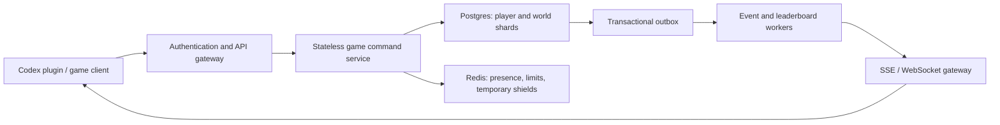

# Token Harbor Multiplayer Architecture

## Product Boundary

Each player owns a separate harbor and save. Friends may visit, send supplies, compare progress, or launch a temporary raid, but they never co-edit the same harbor. Social actions cannot steal tokens, delete vessels, or cause permanent resource loss.

The current release remains local and single-player authoritative. It already uses player, world, command, revision, and event contracts that match the planned cloud version, allowing storage and transport to change without rewriting fishing and harbor rules.

## Existing Contracts

Every save includes:

- Stable `playerId` and private `worldId` values.
- A monotonic `revision` for ordering updates and detecting stale clients.
- Durable on-disk `actionId` receipts, so retries remain idempotent after the bounded in-save receipt cache rolls over or the process restarts.
- A bounded domain-event outbox with monotonic per-consumer acknowledgement cursors. Consumers receive `gapDetected` / `requiresSnapshot` when their cursor predates retained history.
- An SSE event stream with low-frequency polling as a disconnect fallback.
- A client-safe snapshot without Codex task IDs, telemetry receipts, or internal outbox records.

Command envelope:

```json
{
  "actionId": "action_uuid",
  "actorId": "player_uuid",
  "worldId": "world_uuid",
  "baseRevision": 42,
  "type": "game.launch_voyage",
  "payload": { "routeId": "nearshore" }
}
```

Event envelope:

```json
{
  "eventId": "world_uuid:43",
  "worldId": "world_uuid",
  "revision": 43,
  "type": "game.launch_voyage",
  "actorId": "player_uuid",
  "actionId": "action_uuid",
  "occurredAt": "2026-07-19T12:00:00.000Z",
  "payload": { "routeId": "nearshore" }
}
```

The local API provides `/api/multiplayer/status`, `/snapshot`, `/events`, `/ack`, `/api/events`, `/api/social/status`, and `/api/social/config`.

Every state-changing browser command includes the full envelope and must match the current `worldId` and exact `baseRevision`; stale or cross-world commands receive HTTP 409. A duplicate durable `actionId` is returned as the already-applied success before revision validation, which makes a network retry safe. The client serializes commands, reads the latest revision when each queued command starts, rejects older GET responses, and uses SSE revision metadata to avoid unnecessary refreshes.

## Social Features

- Friend harbors: inspect docks, fleets, rare-fish displays, and recent achievements.
- Visit keepsakes: guestbook templates, photo postcards, and regional stamps. Structured templates reduce text-moderation risk.
- Daily supplies: send small repair kits, weather forecasts, or voyage boosts with daily limits.
- Repair assistance: friends may clear one tangled-net effect and earn Helpful Captain points.
- Multiple leaderboards: Harbor Prosperity, Weekly Distance, Rare Collection, and Helpful Captains remain separate so a single spending metric cannot dominate every rank.
- Friend raids: Lighthouse Blackout, Tangled Nets, and False Beacon are temporary and repairable. Raids require friendship, a ticket, a six-hour target cooldown, 72-hour new-player protection, a post-raid shield, and a limit of one active effect.
- Fleet challenges: friends contribute separate voyages toward time-limited distance or species goals and share milestone rewards.
- Harbor activity: only structured events such as port unlocks, legendary catches, and distance records are shared. Codex conversations are never uploaded.

## Cloud Data Model

Use a relational database as the authority:

- `players`, `harbors`, `harbor_memberships`
- `friendships`, `friend_requests`, `harbor_visits`, `gifts`
- `raid_attempts`, `raid_effects`, `raid_cooldowns`
- `leaderboard_scores`, `seasons`, `crew_challenges`
- `action_receipts`, `world_snapshots`, `game_events`, `event_outbox`

Every resource-changing action must be validated and committed inside a server transaction. Clients cannot decide token credits, fish drops, rarity, leaderboard scores, or raid outcomes.

## Scaling Topology



Use `world_id` as the data-sharding key. Materialize leaderboard scores asynchronously instead of scanning all players after every command. Serve images through a CDN. Friendships, raids, and leaderboards should remain separate service boundaries that can scale independently.

## Release Stages

1. Local foundation: stable identity, command deduplication, revisions, outbox, SSE, and social rules. Complete.
2. Invite test: add authentication, cloud saves, friend invitations, harbor visits, and friend leaderboards while retaining local offline mode.
3. Social test: add gifts, cooperative goals, and protected raids with limited rollout and behavior monitoring.
4. Expansion: add regional leaderboards, event workers, Redis limits, and data sharding based on measured bottlenecks.

Before stage 2, the interface must not imply that real friends or global rankings already exist. The current endpoints are testable foundation contracts, not a live multiplayer service.
